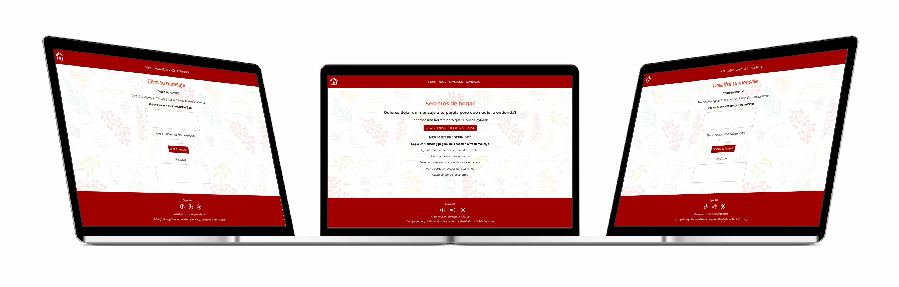

# Definición del producto: Secretos de hogar

## Descripción:
Secretos de hogar es una herramienta para codificar y decodificar un mensaje destinado a la pareja, marido o esposa. El objetivo es que la pareja pueda comunicar sin que los niños o otros miembros de la familia o personas con cuál comparten el hogar entiendan el mensaje. 
<strong>El método de cifrar:</strong>
En criptografía, el cifrado César, también conocido como cifrado por desplazamiento, código de César o desplazamiento de César, es una de las técnicas de cifrado más simples y más usadas. Es un tipo de cifrado por sustitución en el que una letra en el texto original es reemplazada por otra letra que se encuentra un número fijo de posiciones más adelante en el alfabeto. El cifrado usa el alfabeto de 26 letras sin ñ u otros caracteres con diacriticos. 
A B C D E F G H I J K L M N O P Q R S T U V W X Y Z 
<strong>Como funciona?</strong>
Las personas que intercambian mensajes tienen que fijar un número de desplazamiento (clave). El número tiene que ser positivo. El mensaje puede contener letras minúsculas, mayúsculas, espacio entre palabras. No puede contener números, simbolos, o letras con diacríticas.  
<strong>Codear el Propotype:</strong> 
Al ingresar a la página se puede elegir entre Encriptar un mesaje o Descriptar un mesaje. También se puede encontrar una lista de mesajes predefinidos que se pueden usar.
Definición del usuario:
Los usuarios son parejas que viven junto con otros miembros de familia u otras personas
El producto puede facilitar una comunicación confidencial aunque el mensaje está a la vista de varias personas pero solo quien conoce la clave puede saber el contenido del mensaje.   
## Definición UX
Secretos de hogar es una herramienta debe entregar sensación de confidencialidad como la que se encuentra en un hogar. Los usuarios tienen ejemplo de mensajes (mensajes predefinidos) para que el proceso sea más rápido, solo copiar y pegar. 
Al ingresar, el usuario puede elegir entre Cifrar o Descifrar un mensaje haciendo click en el botón CIFRAR UN MENSAJE o en el botón DESCIFRAR UN MENSAJE. 
Despúes de presionar el botón se muestra la página para Cifrar o Descifrar. En la página se encuentra un campo donde se ingresa el mensaje, despúes se elije un número de desplazamiento y se apreta el botón CIFRA TU MENSAJE/ DESCIFRA TU MENSAJE. El resultado se muestra el el campo Resultado. 

## Decisiones de diseño

El diseño es de colores alegres: un pattern con hojas de distantas colors, con opacidad 30% para que sea legible el texto que viene arriba. 

### Tipografía
Montserrat Bold 
Para los títulos H1 

Aa Bb Cc Dd Ee Ff Gg Hh Ii Jj Kk Ll Mm Nn Oo Pp Qq Rr Ss Tt Uu Vv Ww Xx Yy Zz

Raleway Regular 
Para los parágrafos.  

Aa Bb Cc Dd Ee Ff Gg Hh Ii Jj Kk Ll Mm Nn Oo Pp Qq Rr Ss Tt Uu Vv Ww Xx Yy Zz

El proceso de diseño empezó con el sketch en Balsamiq, después el prototipo en Figma y el mockup.

### Sketch

- HOMEPAGE 

- PÁGINA CIFRAR 

- PÁGINA DESCIFRAR 

### Prototipo de alta fidedlidad
Se realiza en Figma y nos permite realizar prubas del producto, pruebas de colores, composición y diseño, con el proposito de llegar al diseño final.

<video width="320" height="240" controls>
  <source src="figma.webm" type="video/mp4">
</video>

### Mockup

### Testeos de usabilidad
- En primera fase realicé test de usabilidad con 2 usuarios y la conclusión estuvo que un boton no sirve y trae más confusión. En la imágen se puede ver el diseño inicial. 

- En la segunda fase, después de finalisar el diseño hice test con otros 2 usuarios. En los links se pueden ver. 
-> <a href="https://www.loom.com/share/128984760822480cbb6edcd8723c6705" target="_blank">Usuario 1</a> 
-> <a href="https://www.loom.com/share/5abe9d58a07c4a1d8109f0813527fb0d" target="_blank">Usuario 2</a> 

#### Problema de usabilidad
- Los usuarios señalaron que el boton Descifrar de la página Cifrar hace confondirse, también el boton Cifrar de la página Descifrar
- Los usuarios ingresaron simbolos dentro del texto para cifrar o descifrar y no resultó
#### Conclusión
- Se renuncia al los botones Cifrar y Descifrar
- Se agrega una nota donde se explica que se puede ingresar solo minusculas, mayusculas y espacio libre.

## Interfaz de usuario (UI)

La interfaz permite al usuario:
- Elegir un número de desplazamiento positivo (no puede ser negativo)
- Insertar un mensaje (texto) que queremos cifrar. El mensaje puede incluir minusculas, mayusculas, espacio entre palablar. No puede incluir caracteres con diacriticos, simbolos o numeros.
- Ver el resultado del mensaje cifrado.
- Descifrar un mensaje.
- Ver el resultado del mensaje descifrado.
Para Cifrar el usuario ingresa a la página, hace click al boton Cifra tu mesaje. Después se muestra la página Cifrar donde puede ingresar el mensaje, elejir un número de dezplasamiento, hacer click en el boton Cifrar y ver el resultado. Para llegar a cifrar se necesita 3 click y escribir el mensaje para cifrar. Al final, el usuario puede limpiar los campos apretando el boton Limpiar y hacer una nueva codificación. Si no desea otra codificación puede volver a la página Home apretando el boton Home.

## Desarrollo de la página
- Para desarrollar la página usé un index.html donde se encuentra la estructura(div, titulos, paragrafos, textarea, botones, etc), los elementos de conexión entre la estructura y el algoritmo (a traves de id, script, link rel). 
- Para el movimento dentro de la página usé index.js donde se encuentran todos los eventos de DOM, como addEventListener para activar el click de los botones a traves de getElementById que rescata los valores ingresados por el usuario.
- El algoritmo del cifrado se encuentra en cipher.js donde usé un objeto que me permita varias acciones: 
  - la bucle que repite el proceso de codificar/decodificar hasta que se recorre todo el texto que se desea cifrar/descifrar; 
  - codiciones a la funcion cifrar y descifrar. Dentro de las condiciones apliqué la formula del Cifrado Cezar adaptada para el código ASCII que es el código estandar para caracteres para comunicaciones electronicas. Implementé condición para minusculas, mayusculas y espacio libre entre palabras. 

- Para testear mi código usé cipher.spec.js con el wireframe Mocha BDD. El test se realisa usando funciones describe(), it(), assert.
- El ultimo proceso estuvo subir el proyecto al GitHub usando el terminal de VisualEstudio y los comandos add, commit, push.
## Planificación de la creación del proyecto
Para la planificación usé un checklist del proceso y el daily para seguimento.
Durante la elaboración del proyecto he tenido que estudiar y encontrar soluciones de manera independiente, buscar distintas fuentes y encontrar la más adecuada para mi estilo de aprendizaje.
## Conclusiones
La web está diriga a las familias o parejas que comparten el espacio para vivir con otras personas, miembros de la familia, amigos etc. Es una herramienta que resuelve la necesidad de tener una comunicación privada y confidencial. 
Los tests de usabilidad ayudaron a adaptar los prototipos y establecer el diseño final de la web. De esta menera se llegó al producto final y funcional, los usuarios pueden cifrar y descifrar sus mensajes con la posibilidad de elegir el número de dezplasamiento.